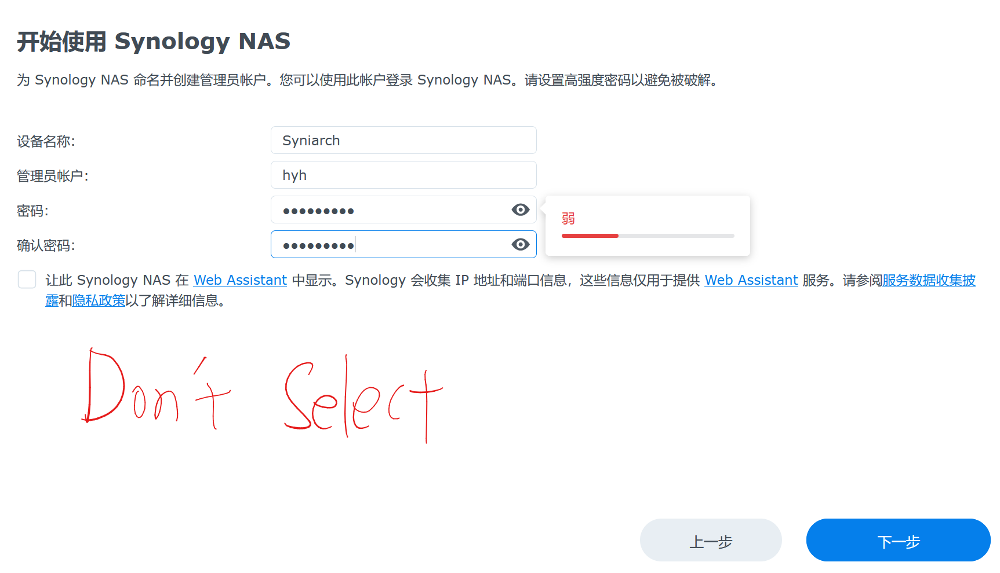

**Mind your data. Mind your data. Mind your data.**
**The project with its affiliation is released for educational and learning purpose only, commercial application of the software is strictly prohibited.**
1. Preparation
	a. Download rr-xx.x.x.img.zip https://github.com/RROrg/rr/releases
	b. Download Rufus http://rufus.ie/zh/
	c. Download 微PE https://www.wepe.com.cn/download.html
	d. Prepare a thumb drive, a keyboard, a mouse, a disk(or more) & a monitor
	e. Plug the disk and 
2. Create a bootloader
	a. Boot from a thumb drive(Way One)
	a.1 Open Rufus & select image file, then flash
	a.2 Plug the thumb drive on NAS

	b. Boot from embedded emmc(Way Two)
	b.1 Open 微PE & flash to a thumb drive(Here skip the step)
	b.2 Copy the rr-xx.x.x.img.zip to the thumb drive
	
	b.3 Plug the thumb drive on NAS & turn on NAS
	b.4 Open DiskGenius & right click the emmc & Select Restore Disk From Image
	
	b.5 Select rr.img(Uncompressed) & Start
	b.6 Reboot & Unplug the thumb drive
3. Configure Loader(Refer https://www.bilibili.com/video/BV1W4421X7F3)
	a. Selsct Configure Loader
	
	b. Ask the website on PC or phone
	
	c. Change Language(Recommended)
		
	d. Select "choose a model"
	e. Choose "DS3622xs+"
	
	f. Choose "Cmdline menu"& "Define SN/MAC"(if you have a whitewash condition)
	
	
	
	g. Choose a version & Build (Here skip the step. You can enter OK all.)
	h. Untill Display this, you can access the website(you may wait some minutes)

4. First boot Hack-Synology
	a. Download system from official site & choose the pat file &wait,wait,wait

	b. Following the images

 
	c.Enjoy! Would you like to buy me a cup of milk tea in the company?
	
